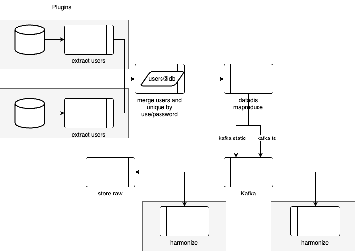

# Datadis description
This module will import data from Datadis and harmonize it from different sources.

The following image depicts the workflow of the script.



## Gather data

The data gathering process consists of a set of plugins that collect users and passwords from multiple databases and 
store them in a Redis queue. This queue is then processed to retrieve the devices assigned to each user, which are 
uploaded into another Redis instance. Finally, the second queue, containing user-device mappings, is processed to 
extract the data from each device.

###### Howto
The data gathering process consists of a two-step application:

### 1. Producer  
The producer collects user data and can be started with the following command:

```bash
python3 launcher.py -p last -l producer
```
### 2. Consumer  
The consumers process the user queue, generate a new devices queue, process it, and retrieve data from the devices. You can start the consumers with:
```bash
python3 launcher.py -p last -l consumer
```

## Harmonize data

To harmonize the gathered data, Faust applications have been developed.  

- One application stores the raw timeseries data in HBase.  
- Another application harmonizes the supply data into the corresponding Neo4j database. And if set up, stores the 
harmonized timeseries data into the corresponding database.

###### Howto:
Run the following command to store raw data in HBase:  
```bash
python3 -m store_raw worker -l info
```
Execute the appropriate command based on the data source:
```bash
# ICAEN
python3 -m plugins.icaen worker -l info
# Infraestructures
python3 -m plugins.infraestructures worker -l info
```

## Deploy in production

To deploy in production, we need to dockerize the project using the included Dockerfile
```bash
docker buildx build --push -t docker.tech.beegroup-cimne.com/jobs/datadis . --provenance false
```
Using the Kubernetes YAML configurations included in `kubeconfigs`, deploy the project to the cluster:
```bash
kubectl apply -f kubeconfigs/services.yaml 
```

Create the required secrets:
```bash
#basic secret
kubectl create secret generic datadis-harmonize-secret --from-file=config.json=config.json -n datadis
#icaen secret
kubectl create secret generic datadis-icaen-secret --from-file=config_icaen.json=plugins/icaen/config_icaen.json -n datadis
#icat secret
kubectl create secret generic datadis-icat-secret --from-file=config_infra.json=plugins/infraestructures/config_infra.json -n datadis
```
